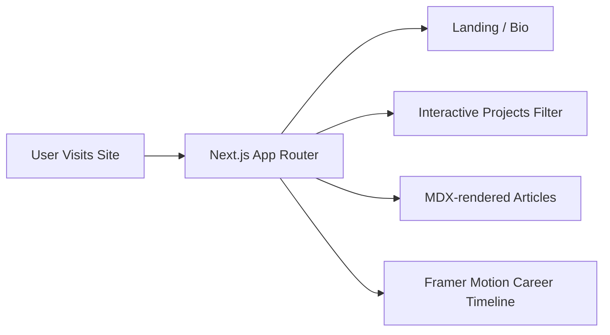

# 💼 My Portfolio: Personal Developer Showcase

My Portfolio is a premium, minimalist developer portfolio designed to showcase engineering projects, writeups, and career achievements. It uses Next.js (App Router) for static rendering and performance optimization, styled with Tailwind CSS and animated using Framer Motion.

---

## 🛠️ Technology Stack

- **Framework**: Next.js (App Router)
- **Styling**: Tailwind CSS (with CSS variable themes)
- **Animation Engine**: Framer Motion
- **Blog Engine**: MDX (Markdown with JSX)
- **Deployment**: Vercel

---

## 📂 Proposed Codebase Directory Structure

Organize your portfolio workspace to maintain separation of static posts, page layouts, and layout animations:

```text
my-portfolio/
├── src/
│   ├── app/                   # Next.js App Router (pages and server actions)
│   │   ├── layout.jsx         # Global HTML layout and theme providers
│   │   ├── page.jsx           # Landing page featuring bio & highlights
│   │   ├── blog/              # MDX blog directories
│   │   └── projects/          # Custom projects archive
│   ├── components/            # Shared React components
│   │   ├── ui/                # Base design items (Buttons, Input, Cards)
│   │   ├── Timeline.jsx       # Animated vertical resume tracker
│   │   └── ProjectCard.jsx    # Hover-animated cards with Framer Motion
│   ├── content/               # Static MDX source folders
│   │   ├── blogs/             # Markdown (.mdx) articles
│   │   └── projects/          # Markdown (.mdx) case studies
│   └── styles/
│       └── globals.css        # Global CSS variables for Light/Dark themes
├── public/                    # Static image files, resume PDFs, and brand assets
├── tailwind.config.js         # Custom theme colors and layout adjustments
├── package.json               # Node dependency declarations
└── README.md                  # Project documentation (this file)
```

---

## 🚀 Key Presentation Features



1. **Static MDX Engine**: Compiles blog posts and project detail pages at build-time, achieving perfect lighthouse optimization scores.
2. **Haptic Animation**: Framer Motion provides spring-physics interactions and page transit fades.
3. **Adaptive Styling**: Automatically matches system Dark/Light mode preferences via Tailwind CSS variants.

---

## ⚡ Quickstart Commands

### 1. Installation
In the root directory, run:
```bash
npm install
```

### 2. Launch Local Development Server
```bash
npm run dev
```
*The dev server runs locally at `http://localhost:3000`.*

### 3. Lint & Build Checks
Perform checks before deploying to Vercel:
```bash
npm run lint
npm run build
```

---

## 🤖 AI Developer Notes

### Context & Second Brain Mapping
- **Second Brain Notes**: Reference active schedules and developer checklists in:
  [Ctx - my-portfolio Context](file:///home/deu/Documents/Technical%20&%20Academins/10%20AI/Context/Coding%20Repos/my-portfolio/Ctx%20-%20my-portfolio%20Context.md) and [Ctx - my-portfolio Inbox](file:///home/deu/Documents/Technical%20&%20Academins/10%20AI/Context/Coding%20Repos/my-portfolio/Ctx%20-%20my-portfolio%20Inbox.md).

### Codebase Invariants
- **SEO & Metadata**: Every page under `src/app/` must declare a static `metadata` object or define a `generateMetadata()` function to optimize SEO metadata dynamically.
- **MDX Resolution**: MDX files must be parsed using safe local directory reading logic (`fs.readFileSync`) to compile meta fronts at build-time.
- **Animation Performance**: Keep Framer Motion calculations lightweight. Use `layoutId` transitions for shared elements (like menu tabs or tabs highlights) rather than triggering complex layouts adjustments.
